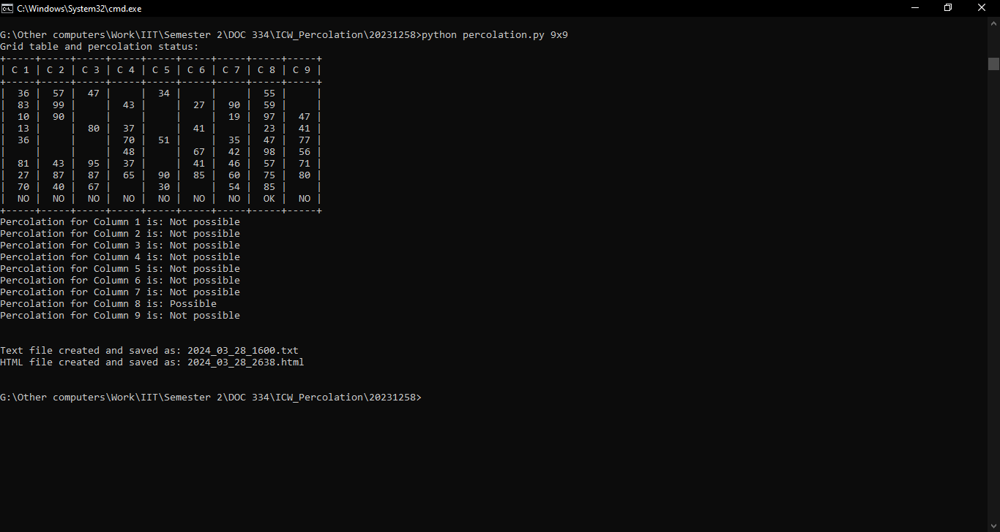
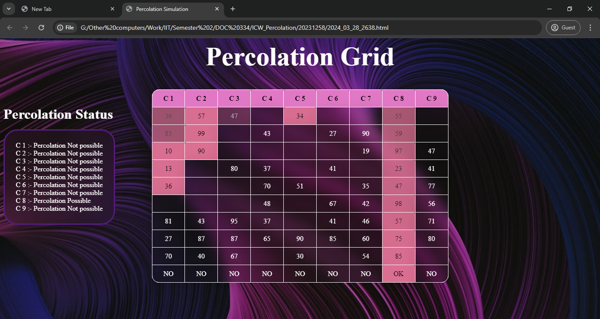
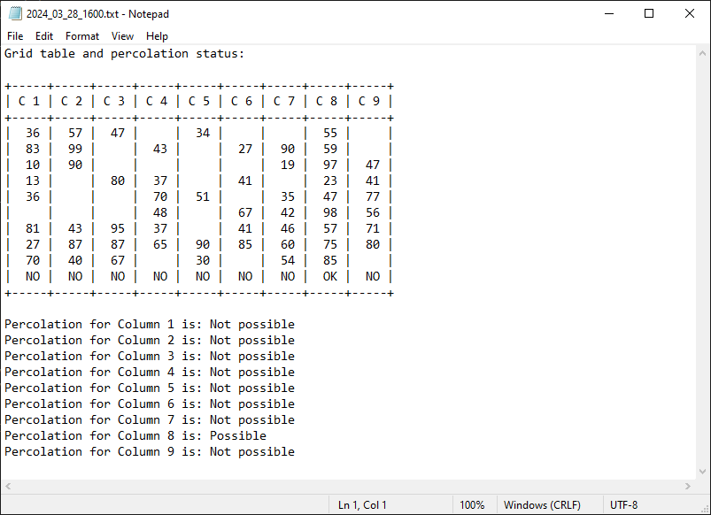

# Percolation Demonstration

This project simulates a **text-based percolation model** in Python to demonstrate how a system "percolates" based on probability thresholds. It uses tabular representations to show simulation results in multiple formats including terminal (CMD), HTML, and plain text output.

---

## 🔢 Features

- **Simulates Percolation Logic**:
  - Demonstrates how filled cells spread through a 2D grid.
  - Controlled by grid size and fill probability.
- **Multiple Output Formats**:
  - View results in:
    - **Command-line table**
    - **Generated HTML file**
    - **Plain text file**
- **Readable Tabular Output**:
  - Uses the `prettytable` library for clean, structured display.

---

## 💻 Technologies Used

- **Python 3.x**
- **[PrettyTable](https://pypi.org/project/PrettyTable/)** – for formatting output tables in various styles (text, HTML)

---

## 🖼️ Output Previews

<div align="center" style="display: flex; flex-wrap: wrap; gap: 20px; justify-content: center; margin: 20px 0;">
  <div style="flex: 1 1 30%; min-width: 250px; text-align: center;">
    
    <p style="margin-top: 8px; color: #666;">Formatted output in command line</p>
  </div>
  <div style="flex: 1 1 30%; min-width: 250px; text-align: center;">
    
    <p style="margin-top: 8px; color: #666;">Generated HTML table view</p>
  </div>
  <div style="flex: 1 1 30%; min-width: 250px; text-align: center;">
    
    <p style="margin-top: 8px; color: #666;">Saved output in a text file</p>
  </div>
</div>

---

## 🚀 Getting Started

To run the project locally:

### 1. Clone the repository

    ```bash
    git clone https://github.com/Anuja-jayasinghe/percolation_demonstration.git
    cd percolation_demonstration

2. Install required library
    ```bash
    pip install prettytable
3. Run the application
```bash
python percolation_demo.py
